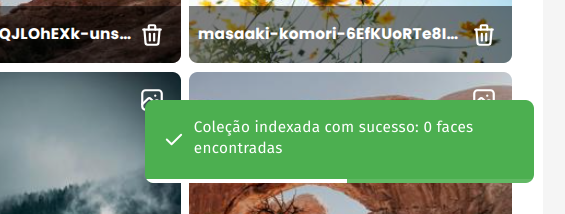

# **Face Finder**

**Face Finder** é um assistente de reconhecimento facial que permite indexar e pesquisar faces em coleções de imagens. Utilizando a biblioteca **InsightFace** (Python) ele extrai, indexa as faces e realiza buscas com base em uma imagem de referência. Tudo isso com suporte a autenticação de usuários e atualizações em tempo real via **SSE (Server-Sent Events)**.

Requisitos mínimos:

- **RAM total da máquina**: 8 GB Desejável, 4 GB Mínimo.
- **CPU**: 2 cores (Mínimo) — para evitar travamento se o Celery exigir mais processamento para tarefas de reconhecimento.
- **Disco**: Pelo menos 10 GB livre (imagens dos containers docker).

## **Tecnologias**

### **Backend**

- **Python** + **FastAPI** (API REST) e **Tortoise-ORM** (Abstração de banco de dados)
- **Celery** (filas de tarefas assíncronas)
- **Redis** (broker para Celery e fila de eventos SSE)
- **PostgreSQL** (armazenamento de dados)

### **Frontend**

- **Vue 3**
- **Vuetify**

## Instruções

Para utilizar o projeto é bem simples. Primeiramente clone este respositório em sua maquina. Em seguida caso ainda não tenha o docker é necessário instalar. E por fim, já dentro da pasta do respositório execute (com privilégios de administrador):

`docker compose up —build`

Assim que acabar de gerar as os containers basta acessar a aplicação em http://localhost:8080. Na primeira utilização é necessário criar um usuário. basta clicar no link “Ainda não tem conta? Cadastre-se”

# Coleções

Após preencher os dados de usuário e realizar cadastro basta enviar a primeira coleção para poder realizar uma pesquisa de faces. A coleção deve ser no formato ZIP e deve conter apenas imagens em formato PNG ou JPG. Outros arquivos serão removidos durante o processo de descompactação. Caso a coleção não possua imagens contendo faces ela não será listada para pesquisa

Após enviar a coleção ela será processada de forma assincrona e a cada atualização de status uma mensagem SSE será enviada para notificar a conclusão de um processo:

# Pesquisa de Faces

Tendo cadastrado sua primeira coleção já é possível realizar uma pesquisa de faces. Como parametros você deve enviar uma imagem que contenha uma única face de referência. Se a imagem não possuir uma face ou se possuir mais de uma face um erro será retornado.
